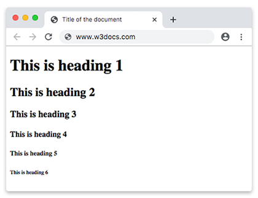
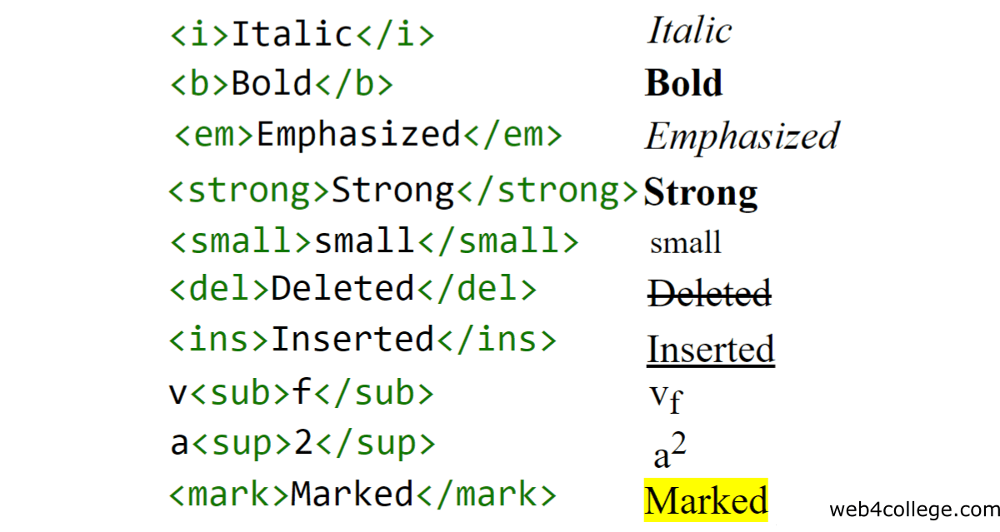

# დავალება 1: HTML-ის ძირითადი თეგების გამოყენება - პითაგორას თეორემა და რიცხვები

## აღწერა

ეს არის ჩემი პირველი HTML პროექტი, სადაც შევქმენი **ორი დაკავშირებული ვებ-გვერდი** **პითაგორას თეორემისა** და **პითაგორას რიცხვების** ასახსნელად. ამ პროექტის მიზანი იყო სხვადასხვა HTML თეგების სწორად და ეფექტურად გამოყენების პრაქტიკა შინაარსის სტრუქტურირებისთვის.

- **`index.html`**: ეს გვერდი ფოკუსირებულია **პითაგორას თეორემაზე**, მის ფორმულაზე, გრაფიკულ ახსნასა და დამტკიცებაზე. ასევე მოიცავს თეორემის შებრუნებულ დამტკიცებას.
- **`pythagorean_numbers.html`**: ეს გვერდი ხსნის **პითაგორას რიცხვებს** (ასევე ცნობილი როგორც პითაგორას სამეულები), მათ თვისებებს და მათი გენერირების წესებს, მათ შორის სპეციალურ შემთხვევებს კენტი და ლუწი რიცხვებისთვის.

ორივე გვერდი ერთმანეთთან დაკავშირებულია, რაც მომხმარებლებს საშუალებას აძლევს თავისუფლად გადაადგილდნენ თეორემასა და რიცხვებს შორის. ასევე მოცემულია გარე ბმულები პითაგორას შესახებ დამატებითი ინფორმაციისთვის.

> [!NOTE]
> გვერდი არ არის რესფონსიული. საუკეთესო გამოცდილებისთვის გთხოვთ ნახოთ დესკტოპის ბრაუზერში.

## მოთხოვნები

- [x] შექმენით ვებგვერდი სხვადასხვა HTML თეგების გამოყენებით, როგორც ნაჩვენებია ქვემოთ მოცემულ სურათებზე.

## მიღებული გამოცდილება

- **HTML-ის გაუმჯობესებული გაგება**: შევიძინე მყარი ცოდნა ძირითადი HTML თეგების და მათი სწორი გამოყენების შესახებ.
- **მათემატიკური შინაარსი ვებ-გვერდებზე**: ვისწავლე მათემატიკური ფორმულებისა და სიმბოლოების ჩასმა HTML ერთეულებისა და ძირითადი ტექსტის ფორმატირების გამოყენებით.
- **შინაარსის სტრუქტურირება**: ვივარჯიშე შინაარსის ორგანიზებაში სათაურების, პარაგრაფებისა და სიების გამოყენებით.
- **ვიზუალური წარდგენა**: შევისწავლე, როგორ გავხადო შინაარსი ვიზუალურად მიმზიდველი ძირითადი HTML ელემენტების გამოყენებით, როგორიცაა მუქი, დახრილი ტექსტი და ხაზის გადატანა.
- **გვერდების დაკავშირება**: ვისწავლე შიდა ბმულების შექმნა რამდენიმე გვერდის დასაკავშირებლად და გარე ბმულები დამატებითი რესურსების მისათითებლად.

## გამოყენებული HTML თეგები

ამ პროექტში გამოვიყენე სხვადასხვა HTML თეგები შინაარსის ეფექტურად სტრუქტურირებისთვის. ქვემოთ მოცემულია ყველა გამოყენებული თეგის სია მათი დანიშნულებით:

### სტრუქტურული თეგები

- `<!DOCTYPE html>`: განსაზღვრავს დოკუმენტის ტიპს და HTML-ის ვერსიას.
- `<html>`: HTML დოკუმენტის ძირითადი ელემენტი.
- `<head>`: შეიცავს მეტა-ინფორმაციას დოკუმენტის შესახებ, როგორიცაა სათაური და სიმბოლოების კოდირება.
- `<title>`: განსაზღვრავს ვებგვერდის სათაურს, რომელიც ჩანს ბრაუზერის ჩანართში.
- `<meta>`: უზრუნველყოფს მეტამონაცემებს HTML დოკუმენტის შესახებ, როგორიცაა სიმბოლოების კოდირება და საკვანძო სიტყვები.
- `<body>`: შეიცავს ვებგვერდის ხილულ შინაარსს.

### ტექსტის ფორმატირების თეგები

- `<h1>` - `<h6>`: გამოიყენება სათაურებისთვის შინაარსის იერარქიულად სტრუქტურირებისთვის.
- `
`: პარაგრაფებისთვის, ტექსტის ბლოკების გასამიჯნად.
- `<strong>`: მუქი ტექსტისთვის მნიშვნელოვანი პუნქტების ხაზგასასმელად.
- `<em>`: დახრილი ტექსტისთვის აქცენტის დასამატებლად.
- `<b>`: მუქი ტექსტისთვის (გამოიყენება ვიზუალური ხაზგასმისთვის).
- `<i>`: დახრილი ტექსტისთვის (გამოიყენება ხაზგასმისთვის ან ციტირებისთვის).
- `<small>`: პატარა ტექსტისთვის, ხშირად გამოიყენება განმარტებებისთვის ან წარწერებისთვის.
- `<ins>`: ხაზგასმული ტექსტისთვის დამატებების აღსანიშნავად.
- `<del>`: გადახაზული ტექსტისთვის წაშლების აღსანიშნავად.
- `<mark>`: მნიშვნელოვანი ტექსტის გამოსაყოფად ფონის ფერით.
- ``: ზედა ინდექსისთვის, სასარგებლოა მათემატიკური აღნიშვნებისთვის, როგორიცაა ხარისხები.
- ``: ქვედა ინდექსისთვის, სასარგებლოა ინდექსებისთვის მათემატიკურ ფორმულებში.
- ` `: ხაზის გადატანისთვის დაშორების საკონტროლოდ.
- `
`: ჰორიზონტალური ხაზების შესაქმნელად ვიზუალური გამიჯვნისთვის.

### ბმულები და ნავიგაცია

- `<a>`: ჰიპერბმულებისთვის გარე რესურსებთან ან სხვა გვერდებთან დასაკავშირებლად. გამოიყენება `href` ატრიბუტთან ერთად დანიშნულების ადგილის მისათითებლად.
- `target="_blank"`: გამოიყენება `<a>` თეგებში ბმულების ახალ ჩანართში გასახსნელად.

### სურათები

- ``: ვებგვერდზე სურათების ჩასასმელად. გამოიყენება `src` ატრიბუტთან ერთად სურათის წყაროს მისათითებლად და `alt` ალტერნატიული ტექსტისთვის.

### სიები

- `<ul>`: დაულაგებელი სიების შესაქმნელად.
- `<li>`: სიის ელემენტებისთვის `<ul>` ან `<ol>` თეგებში.

### სპეციალური სიმბოლოები

- HTML ერთეულები, როგორიცაა `&lt;`, `&gt;`, და `&amp;` გამოყენებულია სპეციალური სიმბოლოების გამოსაჩენად.

## გამოყენებული ტექნოლოგიები

---
