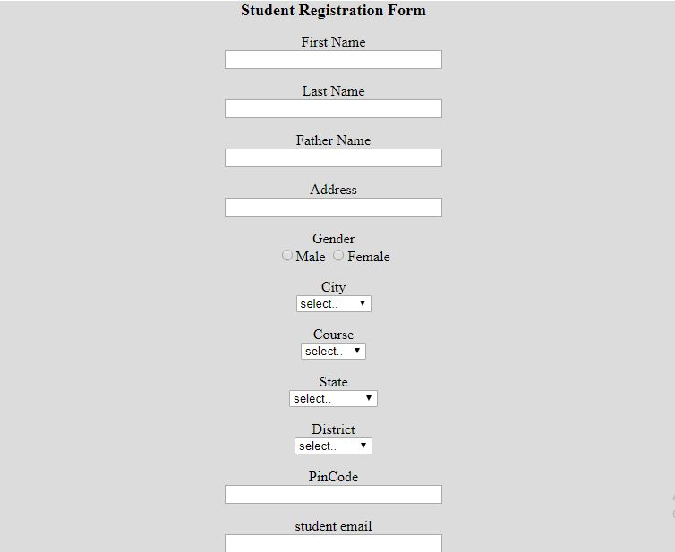

# დავალება 2.1: HTML ფორმებთან მუშაობა - სტუდენტთა რეგისტრაციის ფორმა

## აღწერა

ეს HTML პროექტი ფოკუსირებულია **ფორმის ელემენტების** შექმნაზე და მათი ფუნქციონირების გაგებაზე. პროექტის მიზანი იყო სხვადასხვა ტიპის ფორმების, შეყვანის ველების და ფორმის კონტროლების იმპლემენტაციის პრაქტიკა, HTML-ის სწორი სტრუქტურისა და ვალიდაციის შენარჩუნებით.

- **`index.html`**: მთავარი გვერდზე მოცემულია სტუდენტთა რეგისტრაციის ფორმა, რომელიც შეიცავს შეყვანის ველებს, მათ შორის სხვადასხვა input ტიპებს, რადიო ღილაკებს, ჩეკბოქსებს, ჩამოსაშლელ მენიუს. ნაჩვენებია ფორმის სწორი ვალიდაცია და ფორმის გაგზავნის ღილაკი.

> [!NOTE]
> ეს გვერდი არ არის ოპტიმიზირებული მობილური მოწყობილობებისთვის. საუკეთესო გამოცდილებისთვის, გთხოვთ, ნახოთ ბრაუზერში.

## მოთხოვნები

- [x] შექმენით ფორმები სხვადასხვა HTML ფორმის ელემენტებისა და კონტროლების გამოყენებით (როგორც ნაჩვენებია ქვემოთ მოცემულ სურათზე)
- [x] განახორციელეთ ფორმის სწორი ვალიდაცია
- [x] გამოიყენეთ შესაბამისი input ტიპები სხვადასხვა მონაცემებისთვის
- [x] ჩასვით სწორი label-ები და placeholder-ები
- [x] სწორად დაამუშავეთ ფორმის გაგზავნა

## მიღებული გამოცდილება

- **ფორმის სტრუქტურა**: ფორმის ელემენტების სწორი სტრუქტურისა და ჩადგმის გაგება
- **Input ტიპები**: სხვადასხვა input ტიპებისა და მათი სპეციფიკური გამოყენების შესწავლა
- **ფორმის ვალიდაცია**: კლიენტის მხარეს ვალიდაციის განხორციელება HTML5 ატრიბუტების გამოყენებით

## გამოყენებული HTML თეგები

### ფორმის ელემენტები

- `<form>`: ყველა ფორმის კონტროლის კონტეინერი ელემენტი
- `<input>`: სხვადასხვა ტიპის შეყვანის ველებისთვის
- `<label>`: ფორმის კონტროლებთან ტექსტური წარწერების დასაკავშირებლად
- `<select>`: ჩამოსაშლელი მენიუსთვის
- `<option>`: ინდივიდუალური ვარიანტები select ელემენტებში
- `<textarea>`: მრავალხაზიანი ტექსტის შეყვანისთვის
- `<button>`: ფორმის გაგზავნისა და გადატვირთვის ღილაკებისთვის
- `<fieldset>`: დაკავშირებული ფორმის ელემენტების დასაჯგუფებლად
- `<legend>`: fieldset ელემენტებისთვის სათაურის მისაცემად

### Input ტიპები

- `type="text"`: ერთხაზიანი ტექსტის შეყვანისთვის
- `type="email"`: ელ-ფოსტის მისამართებისთვის
- `type="password"`: პაროლის შეყვანისთვის
- `type="number"`: რიცხვითი შეყვანისთვის
- `type="tel"`: ტელეფონის ნომრებისთვის
- `type="date"`: თარიღის არჩევისთვის
- `type="file"`: ფაილების ატვირთვისთვის
- `type="radio"`: ერთი არჩევანის ვარიანტებისთვის
- `type="checkbox"`: მრავალი არჩევანის ვარიანტებისთვის
- `type="submit"`: ფორმის გაგზავნის ღილაკებისთვის
- `type="reset"`: ფორმის გადატვირთვის ღილაკებისთვის

### ფორმის ატრიბუტები

- `required`: სავალდებულო ველების მოსანიშნად
- `placeholder`: შეყვანის მინიშნებების მისაცემად
- `pattern`: შეყვანის ვალიდაციის შაბლონებისთვის
- `min` და `max`: რიცხვითი დიაპაზონის ვალიდაციისთვის
- `maxlength`: შეყვანის სიგრძის შესაზღუდად
- `autocomplete`: ბრაუზერის ავტოშევსების ქცევის სამართავად

## გამოყენებული ტექნოლოგიები

---
